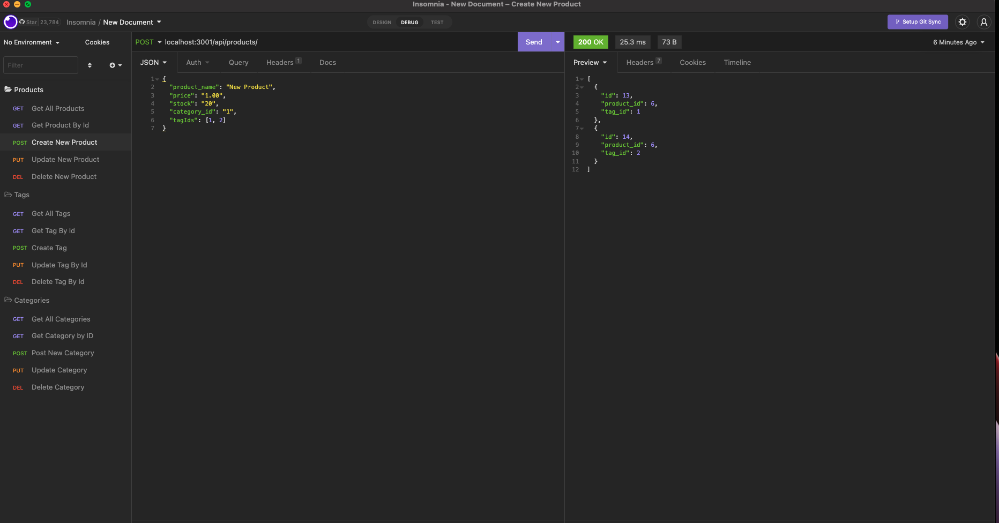

# E-Commerce Back End 

## Description

E-Commerce Back End is a sample back end application that allows users to interact with a database on a fuller level. Not only can you get information from the database, but you can also create, update, and delete as well. The information can be accessed in the following ways: get all (products, tags, and categories), get one of them by id, create a new one, update an old one (based on id), or delete one (based on id). The back end is accessed through Insomnia or another fetch application.

The program requires users to create and use the database (using mysql in your terminal). Upon running "npm run start", the server begins prompting and users can begin using Insomnia to access the api/back end. Routes to the backend are created using Javascript/express. Sequelize allows models to be connected to database and the requests. 

## Installation

Before running the program, users must run "npm i" to get the packages and node modules. They must also source the schema.sql file. If the user would like to start off with some seeds, they can run "npm run seed" in order to populate the database with the seed files. Users will also have to fill out the appropriate information on a local .env form so that they can access the sql database for the requests. In order to quit the server, users must press "control c" simultaneously on their keyboard.

## Usage

Run "npm run start" to start the server and then use Insomnia (or a fetch tool) as a "front end" to hit the back end of this app.

## Questions 

 If you have any questions, email me at cmckee120993@gmail.com. 

 You can view more of my work at [cmckee120993](https://github.com/cmckee120993).

## Site in Action

Click on the screenshot above to be taken to a video recording of this project in action.